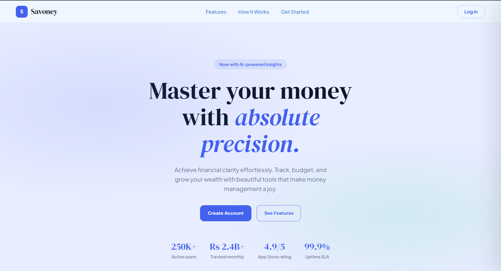
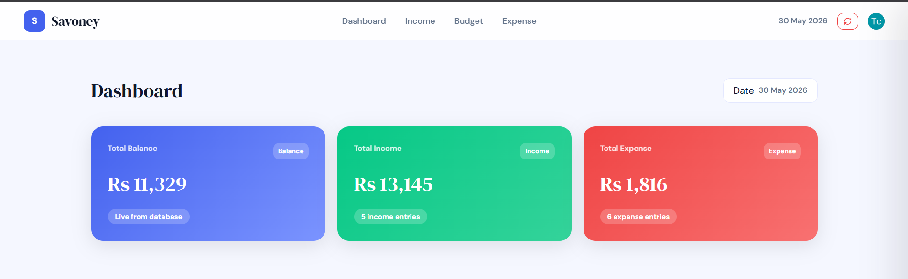
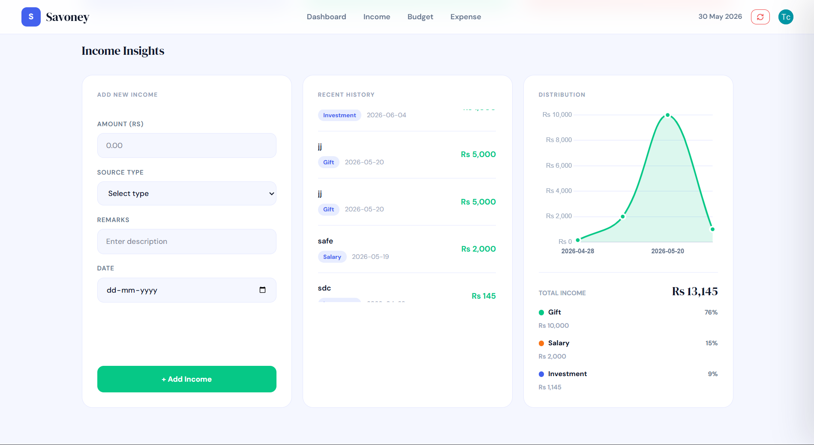
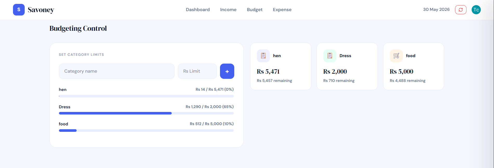
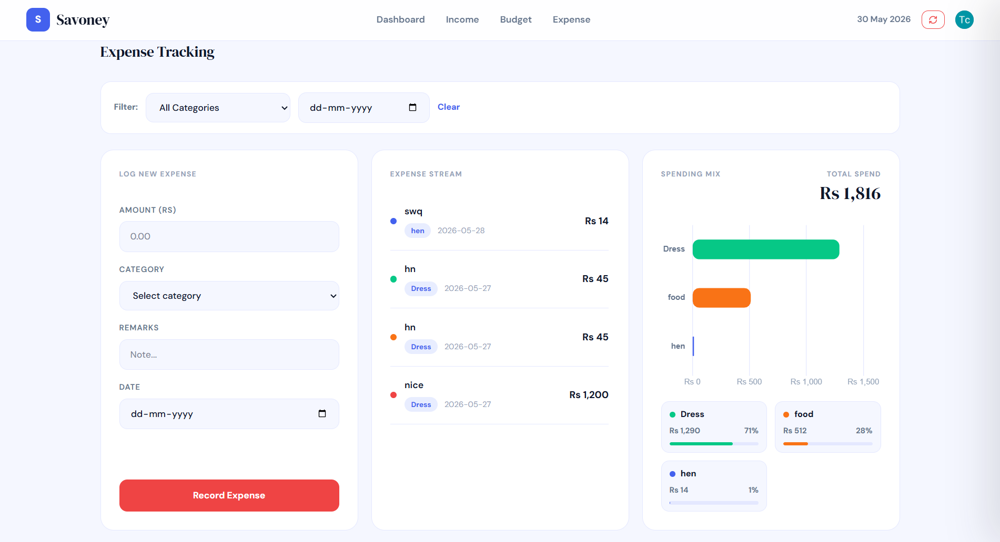
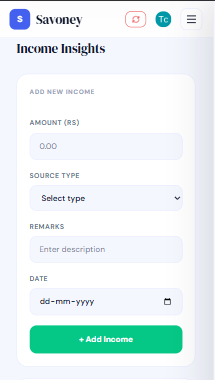

# Savoney

Savoney is a full-stack personal finance dashboard built for tracking income, expenses, budgets, and financial trends across devices. It combines a polished React dashboard with Clerk authentication, a PostgreSQL database, Prisma models, and Express/Vercel API routes so every user's financial data stays private to their account.



## Project Preview

| Landing Page | Dashboard |
| --- | --- |
|  |  |

| Income Insights | Expense Tracking |
| --- | --- |
|  |  |

| Budget Progress | Mobile View |
| --- | --- |
|  |  |

## Highlights

- Secure Clerk authentication with protected dashboard access
- User-specific PostgreSQL persistence through Prisma and Neon
- Income tracking with source history and Chart.js analytics
- Expense tracking with category/date filters and responsive charts
- Budget creation with category-based progress and over-budget states
- Dashboard metrics for balance, income, expenses, and budget usage
- Responsive landing page, dashboard layout, and mobile slide-out menus
- Mobile-safe layouts with horizontal overflow prevented on small screens
- API routes for user sync, income, expense, budget, and database health checks
- Production-friendly Vercel setup with serverless API support

## Tech Stack

| Layer | Technology |
| --- | --- |
| Frontend | React, Vite, React Router |
| Styling | Tailwind CSS, custom component styles |
| Auth | Clerk |
| Charts | Chart.js, react-chartjs-2 |
| Backend | Express.js, Vercel Serverless Functions |
| ORM | Prisma |
| Database | Neon PostgreSQL |
| Deployment | Vercel |

## Folder Structure

```txt
Savoneyy/
  api/                    # Vercel serverless API entrypoints
  prisma/
    schema.prisma         # Database schema
  server/
    app.js                # Shared Express app
    server.js             # Local backend runner
    routes/               # User, income, expense, budget routes
  src/
    components/           # React UI
    lib/api.js            # Frontend API client
    App.jsx
    main.jsx
  utility/
    tokens.js             # Shared design tokens/helpers
  vercel.json             # Vercel routing config
```

## Features

### Authentication

- Clerk sign-in/sign-up flow
- Protected `/dashboard` route
- User sync through `/api/create-user`
- Database user records store `clerkId`, `email`, and `fullName`

### Finance Dashboard

- Add and persist income entries
- Add and persist expense entries
- Create budget categories
- Populate expense category options from saved budgets
- Filter expenses dynamically by category and date
- Show empty states when no data exists
- Refresh safely without losing database-backed data
- Mobile dashboard navigation with section links for Dashboard, Income, Budget, and Expense

### Analytics

- Income distribution chart grouped by source and date
- Expense spending chart grouped by category
- Live dashboard metrics from database data
- Responsive chart cards for desktop and mobile views

### Database Models

Prisma models included:

- `User`
- `Income`
- `Expense`
- `Budget`

Relationships are user-owned and configured with cascading deletes.

## Environment Variables

Create a local `.env` file in the project root.

```env
VITE_CLERK_PUBLISHABLE_KEY=
DATABASE_URL=
FRONTEND_URL=http://localhost:5173
PORT=5000
```

## Local Setup

Install dependencies:

```bash
npm install
```

Generate Prisma client:

```bash
npx prisma generate
```

Push schema to Neon/PostgreSQL:

```bash
npx prisma db push
```

Run the local Express backend:

```bash
npm run dev:server
```

Run the Vite frontend in another terminal:

```bash
npm run dev
```

Open the local Vite URL, usually:

```txt
http://localhost:5173
```

Local `/api` requests are proxied to `http://localhost:5000` by `vite.config.js`.

## Clerk Setup

1. Create a Clerk application.
2. Copy the publishable key into `VITE_CLERK_PUBLISHABLE_KEY`.
4. Set sign-in and sign-up redirects to `/dashboard`.

## Neon and Prisma Setup

1. Create a Neon PostgreSQL project.
2. Copy the database connection string.
3. Set it as `DATABASE_URL`.
4. Run:

```bash
npx prisma db push
npx prisma generate
```

5. Confirm the connection:

```txt
/api/health/db
```

## API Endpoints

| Method | Endpoint | Description |
| --- | --- | --- |
| `GET` | `/api/health` | API health check |
| `GET` | `/api/health/db` | Database health check |
| `POST` | `/api/create-user` | Create or update Clerk-linked user |
| `POST` | `/api/income` | Create income entry |
| `GET` | `/api/income/:clerkId` | Get one user's income entries |
| `POST` | `/api/expense` | Create expense entry |
| `GET` | `/api/expense/:clerkId` | Get one user's expense entries |
| `POST` | `/api/budget` | Create or update budget category |
| `GET` | `/api/budget/:clerkId` | Get one user's budgets |

### Example Payloads

Create user:

```json
{
  "clerkId": "user_123",
  "email": "person@example.com",
  "fullName": "Person Example"
}
```

Create income or expense:

```json
{
  "clerkId": "user_123",
  "amount": 2500,
  "source": "Salary",
  "remarks": "Monthly income",
  "date": "2026-05-30"
}
```

Create budget:

```json
{
  "clerkId": "user_123",
  "type": "Food",
  "amount": 10000
}
```

## Vercel Deployment

Savoney can run frontend and API routes on Vercel.

1. Import the repository into Vercel.
2. Set the build command:

```bash
npm run build
```

3. Add production environment variables:

```env
VITE_CLERK_PUBLISHABLE_KEY=
DATABASE_URL=
FRONTEND_URL=https://your-vercel-domain.vercel.app
```

4. Deploy.
5. Run `npx prisma db push` against the production database if the schema has not been pushed yet.
6. Confirm the API is live:

```txt
https://your-vercel-domain.vercel.app/api/health
https://your-vercel-domain.vercel.app/api/health/db
```

## Useful Scripts

| Command | Purpose |
| --- | --- |
| `npm run dev` | Start Vite frontend |
| `npm run dev:server` | Start local Express backend with watch mode |
| `npm run server` | Start local Express backend |
| `npm run build` | Build production frontend |
| `npm run preview` | Preview production build |
| `npm run lint` | Run ESLint |
| `npx prisma studio` | Open Prisma Studio |
| `npx prisma db push` | Push Prisma schema to database |

